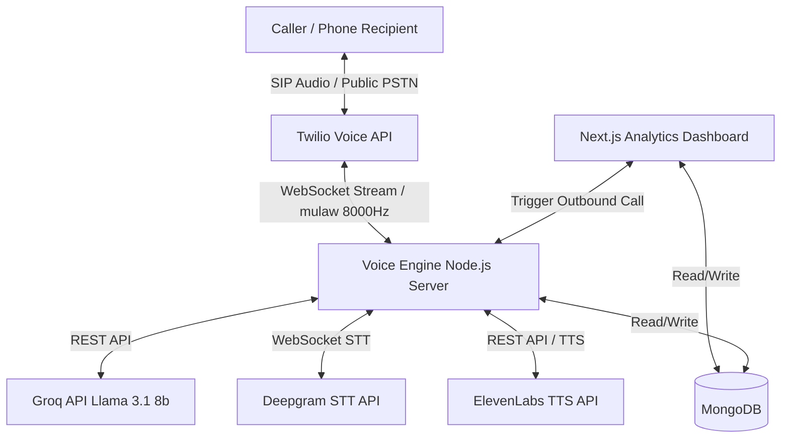
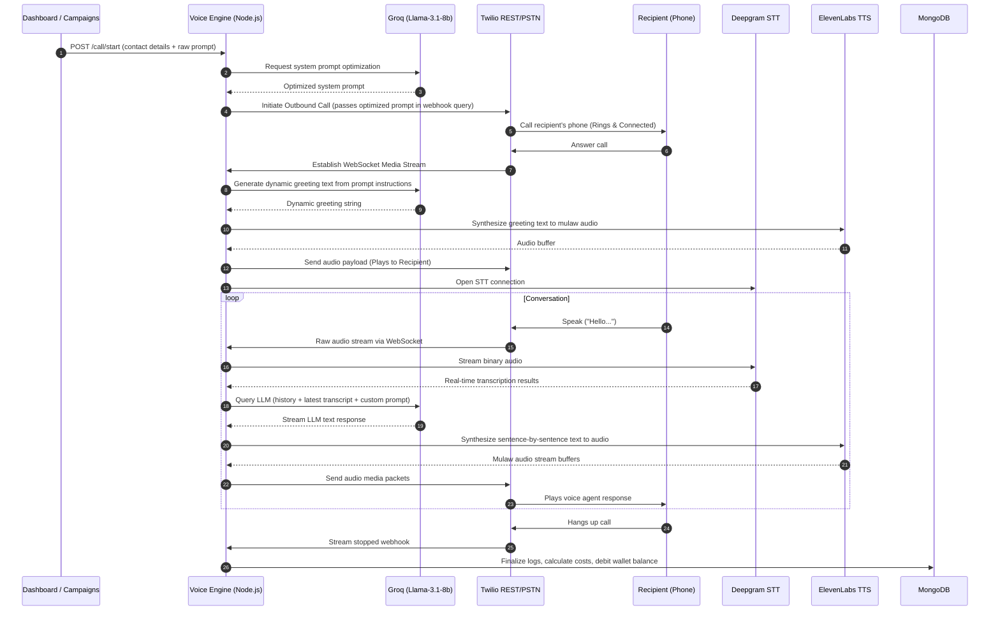

# AI Voice Agent Campaign Manager

A production-ready outbound calling and campaign management system. It features a Next.js 14 Web UI to manage contacts and view call analytics, combined with a Node.js voice engine orchestrating real-time, low-latency, two-way conversational voice calls using Twilio, Deepgram STT, Groq LLM, and ElevenLabs TTS.

---

## Architecture Overview

The system consists of three main components running in a Dockerized environment:
1. **Next.js Dashboard**: Enables user login, wallet top-ups, campaign CSV parsing, manual contact creation, and real-time visualization of call spend metrics.
2. **Node.js Voice Engine**: Orchestrates the active SIP call WebSocket stream and manages API calls to AI providers.
3. **MongoDB Database**: Serves as the shared state store for contacts, user balances, and finalized call logs/billing.



---

## Call Flow Sequence

The diagram below details the end-to-end flow from campaign call initiation to active voice streaming and call termination billing.



---

## Setup Guide

### Prerequisites
* Docker and Docker Compose installed on your system
* ngrok installed (for local webhook tunneling)
* Twilio account with a purchased phone number
* Deepgram, Groq, and ElevenLabs API keys

### Step 1: Clone and Configure Environment

1. Clone this repository to your local directory.
2. Configure the voice engine environment variables. Create a file named `voice-engine/.env` with the following variables:
   ```env
   PORT=5050
   MONGO_URI=mongodb://mongodb:27017/voice-agent-telemetry
   NGROK_AUTHTOKEN=your_ngrok_authtoken
   NGROK_URL=your_ngrok_public_url
   TWILIO_ACCOUNT_SID=your_twilio_account_sid
   TWILIO_AUTH_TOKEN=your_twilio_auth_token
   TWILIO_API_KEY=your_twilio_api_key
   TWILIO_API_SECRET=your_twilio_api_secret
   TRIAL_NUMBER=your_twilio_phone_number
   DEEPGRAM_API_KEY=your_deepgram_api_key
   GROQ_API_KEY=your_groq_api_key
   ELEVENLABS_API_KEY=your_elevenlabs_api_key
   ELEVENLABS_VOICE_ID=pNInz6obpgDQGcFmaJgB
   ```
3. Configure the dashboard environment variables. Create a file named `analytics-dashboard/.env.local` containing:
   ```env
   MONGO_URI=mongodb://localhost:27017/voice-agent-telemetry
   VOICE_ENGINE_URL=http://localhost:5050
   NEXTAUTH_URL=http://localhost:3000
   NEXTAUTH_SECRET=your_nextauth_jwt_signing_secret
   ```

### Step 2: Spin Up the Stack with Docker Compose

Build the images and run the containerized stack:
```bash
docker compose up --build -d
```
This command spins up the following services:
* **mongodb**: Dedicated database container running on port 27017.
* **voice-engine**: Node.js microservice running on port 5050.
* **analytics-dashboard**: Next.js 14 app running on port 3000.
* **ngrok**: Tunneling utility establishing local webhooks to Twilio.

Verify all containers are up and running:
```bash
docker compose ps
```

### Step 3: Seed Database and Create Test User

From the root directory, navigate to the `analytics-dashboard` folder and seed the database with the default testing credentials:
```bash
cd analytics-dashboard
npm install
node seed.js
```
This will seed the database with the default user:
* **Username**: `testuser`
* **Password**: `password123`
* **Starting Balance**: `$20.00`

### Step 4: Login and Make Outbound Calls

1. Open your browser and navigate to `http://localhost:3000`.
2. Log in using the seeded credentials.
3. Access the **Campaigns** tab (`/campaigns`) to manually add single contacts or upload a CSV containing target recipients.
4. Click **Call Now** next to a contact. The system will optimize the raw instruction, establish the SIP connection to the phone, generate a custom greeting, and initiate live voice dialogue.
