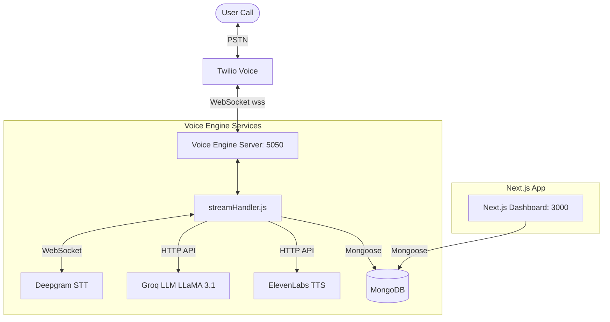

# Project Context & Progress Report

This document serves as a reference for the current development status, architecture, and file structure of the AI Voice Agent project in relation to the [plan.md](file:///c:/Users/abhay/OneDrive/Desktop/calling%20agent/plan.md).

---

## 📊 Current Status Summary

| Phase | Description | Status | Notes |
| :--- | :--- | :--- | :--- |
| **Phase 1** | Phone-to-Server Audio Bridge | **Complete** | Express server running, TwiML incoming webhooks configured, and WebSocket server setup. |
| **Phase 2** | AI Brain, Speech Pipeline & Barge-In | **In Progress** | Services (`deepgram`, `groq`, `elevenlabs`) are created with skeletons. The core connection pipeline in `streamHandler.js` is set to be implemented. |
| **Phase 3** | Telemetry, Logging & Costs | **Not Started** | Database model configured (`CallLog`), calculations pending. |
| **Phase 4** | Next.js Analytics Dashboard | **Ready / Compiling** | Next.js structure is ready, TypeScript config setup complete, compiles successfully. |

---

## 🛠️ Project Structure & Relationships

The project is split into two main sections:
1. **`voice-engine` (Backend API & Audio Pipeline)**
2. **`analytics-dashboard` (Next.js & Telemetry UI)**

### Architecture Diagram



---

## 📂 File Map Reference

* **[`docker-compose.yml`](file:///c:/Users/abhay/OneDrive/Desktop/calling%20agent/docker-compose.yml)**: Manages local dev orchestration (`voice-engine` on 5050, `mongodb` on 27017, and `ngrok` tunnel on 4040).
* **[`voice-engine/server.js`](file:///c:/Users/abhay/OneDrive/Desktop/calling%20agent/voice-engine/server.js)**: Starts HTTP endpoints for Twilio callbacks (`/twilio/incoming`) and handles WS route upgrade (`/media-stream`).
* **[`voice-engine/websockets/streamHandler.js`](file:///c:/Users/abhay/OneDrive/Desktop/calling%20agent/voice-engine/websockets/streamHandler.js)**: The heart of the audio pipeline. This is where you will write the logic connecting Twilio audio buffers to the Deepgram, Groq, and ElevenLabs APIs.
* **[`voice-engine/services/twilioService.js`](file:///c:/Users/abhay/OneDrive/Desktop/calling%20agent/voice-engine/services/twilioService.js)**: Helper functions for generating TwiML.
* **[`voice-engine/services/deepgramService.js`](file:///c:/Users/abhay/OneDrive/Desktop/calling%20agent/voice-engine/services/deepgramService.js)**: Establishes a live streaming websocket connection to Deepgram STT.
* **[`voice-engine/services/groqService.js`](file:///c:/Users/abhay/OneDrive/Desktop/calling%20agent/voice-engine/services/groqService.js)**: Feeds dialogue to Groq to generate responses.
* **[`voice-engine/services/elevenLabsService.js`](file:///c:/Users/abhay/OneDrive/Desktop/calling%20agent/voice-engine/services/elevenLabsService.js)**: Synthesizes text into 8kHz Mu-law binary audio buffers.
* **[`voice-engine/.env`](file:///c:/Users/abhay/OneDrive/Desktop/calling%20agent/voice-engine/.env)**: Contains local application secrets and connection settings.

---

## 🚀 Running the Environment

Ensure your Docker containers are running:
```powershell
docker compose up --build
```
This automatically maps `./voice-engine/.env` into both services, resolving credentials warnings and connecting Ngrok securely.
